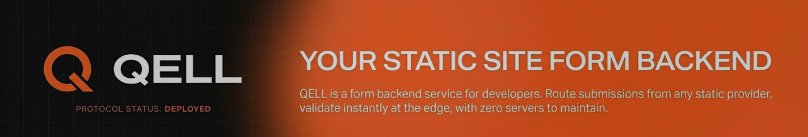

# Hi, I'm Pomilon

I’m a hobbyist developer and technology enthusiast focused on systems, experimental AI architectures, and low-level software design. I enjoy building things from scratch. Most of my work comes from exploring ideas that interest me rather than following predefined product goals. Whether it's language design, AI systems, game engines, or infrastructure experiments.

---

## Highlighted Projects

### AI / Systems / Research

* **[The Dead Internet](https://github.com/Pomilon/The-Dead-Internet)**: A complete, isolated internet infrastructure for AI agents.
* **[CRSM](https://github.com/Pomilon-Intelligence-Lab/CRSM)** & **[Aetheris](https://github.com/Pomilon-Intelligence-Lab/Aetheris)**: Researching alternative AI models and reasoning architectures.
* **[LEMA](https://github.com/Pomilon/LEMA)** & **[LEMA-llama](https://github.com/Pomilon/LEMA-llama)**: A hardware-aware framework for fine-tuning LLMs in VRAM-constrained environments.
* **[ALSI](https://github.com/Pomilon-Intelligence-Lab/ALSI)**: Early exploration of structured state interpretability in modern AI models.

---

### Languages / Infra / Tools

* **[Pome](https://github.com/Pomilon/Pome)** & **[Peck](https://github.com/Pomilon/Peck)**: A scripting language and its package manager ecosystem.
* **[SOLUM](https://github.com/Pomilon/SOLUM)**: A strict, high-performance markup language designed to remove implicit "magic" and opinionated behavior from documents.
* **[Plexir](https://github.com/Pomilon/Plexir)**: A modular, keyboard-centric AI terminal workspace.
* **[Mnemonic](https://github.com/Pomilon/Mnemonic)**: A self-hosted search engine that adapts and learns from the results you reject.

---

### Systems / Media / Engines

* **[Sonir](https://github.com/Pomilon/Sonir)**: A physics-based audio visualizer.
* **[Polir](https://github.com/Pomilon/Polir)**: A simple 2D game engine built with SDL2 and OpenGL.
* **[ManhwaSearch](https://github.com/Pomilon/ManhwaSearch)**: A self-hosted scraper and reader.
* **[Kognit](https://github.com/Pomilon/Kognit)**: An AI technical biographer that audits GitHub profiles to produce professional persona reports, humor profiles, and savage roasts.

---

## Supporting Project

### Qell // Edge-Native Form Backend

Qell is a lightweight ingestion layer for form submissions built on edge infrastructure. It processes requests at the edge, applies structured validation, and routes data securely without maintaining a server. It exists as a practical production system intended to support and fund my independent research and systems work.

[](https://qell.pomilon.xyz)

[Website](https://qell.pomilon.xyz) • [Documentation](https://qell.pomilon.xyz/documentation) • [Support](https://support.qell.pomilon.xyz/support)

---

## Current Status

I have several projects currently in private repositories while I stabilize and refine their architecture. I hope to move them into public repositories once they reach a usable or demonstrable state.

## Tools & Languages

**C / C++** • **Python** • **JavaScript / Node.js**

---

## Why I Build Things

I build projects for my own enjoyment and self-satisfaction, because I can, and because I genuinely love creating. Sharing my work is a way to let others peek into my ideas and experiments, even if most of them are just personal explorations. Nothing is done to impress, it’s all about curiosity, learning, and having fun along the way. (even if sometimes they drive me insane)

Many of my public repositories represent ongoing research or exploratory work rather than finished products.

---

### Perpetual cycle

```
Me
└── My own agent
    └── My agent roasting me
        └── Me laughing alone at the terminal
```

**recursive isolation** as my agent named it. (literally proving it rn) 

> "I wrote SOLUM because even my markup shouldn't be allowed to have an opinion."

---

## Links

[Website]() • [Hugging Face]() • [Pomilon Intelligence Lab]()

> “Just building whatever comes to mind.”
